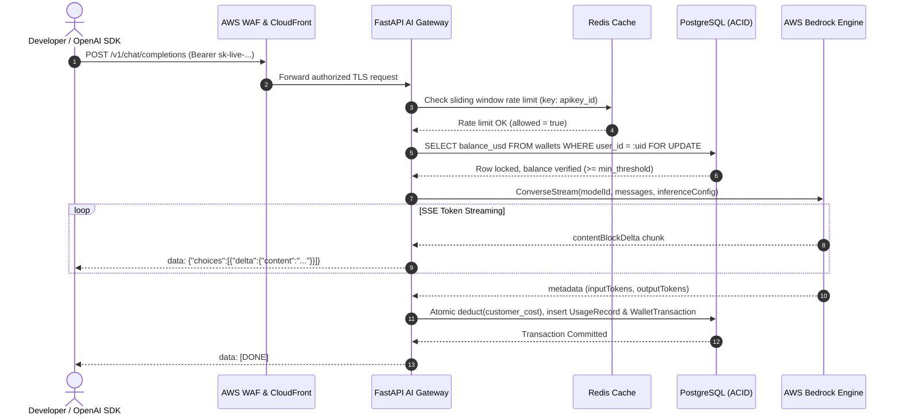

# System Architecture & Technical Specifications

This document outlines the architectural design, abstraction layers, data flow patterns, and concurrency protections implemented in the **AWS Bedrock AI Gateway Platform**.

---

## 1. Architectural Style: Hexagonal / Clean Architecture

The platform backend is structured into distinct, decoupled layers:

```
┌─────────────────────────────────────────────────────────────┐
│                      Presentation Layer                     │
│  - FastAPI Routers (/v1/chat, /v1/models, /api/wallet, etc) │
│  - SSE Streaming Response Engine                            │
└──────────────────────────────┬──────────────────────────────┘
                               │
┌──────────────────────────────▼──────────────────────────────┐
│                      Application Layer                      │
│  - CreditService (Atomic balance checks & debits)           │
│  - UsageService (Token metering & profit margin calculation)│
│  - StripeService (Idempotent webhook & checkout management) │
└──────────────────────────────┬──────────────────────────────┘
                               │
┌──────────────────────────────▼──────────────────────────────┐
│                    Provider Abstraction                     │
│  - IModelProvider (Unified interface)                       │
│  - AWSBedrockProvider (Converse API / InvokeModel)          │
│  - ProviderRouter (Dynamic routing & failover)              │
└──────────────────────────────┬──────────────────────────────┘
                               │
┌──────────────────────────────▼──────────────────────────────┐
│                 Persistence & Infrastructure                │
│  - PostgreSQL 16 (ACID transactions, FOR UPDATE locks)      │
│  - Redis 7 (Sliding window rate limiters & ZSET counters)   │
│  - AWS IAM Role Engine (Task execution credentials)         │
└─────────────────────────────────────────────────────────────┘
```

---

## 2. Ingress & Request Lifecycle



---

## 3. Concurrency Protection & Overdraft Prevention

When a client initiates multiple high-concurrency requests simultaneously with a small balance:
1. **Pessimistic Row-Level Lock**:
   Each inference request immediately locks the user's wallet row using:
   ```sql
   SELECT id, balance_usd FROM wallets WHERE user_id = :uid FOR UPDATE;
   ```
2. **Pre-flight Minimum Check**:
   If the wallet balance is below the minimum reservation threshold (e.g. $0.0005), the request is rejected with `HTTP 402 Insufficient Credits` before invoking AWS Bedrock.
3. **Atomic Post-Stream Ledger Entry**:
   Upon stream completion, exact tokens are calculated, and the customer cost is debited in the same transaction. The `idempotency_key = request_id` constraint prevents duplicate deductions.

---

## 4. AWS Bedrock Converse API Adapter

Different model providers on Bedrock historically required distinct request schemas (e.g., Anthropic Claude used `anthropic_version`, while Meta Llama used raw prompt templates). 

The platform utilizes AWS Bedrock's unified **Converse API** (`converse` and `converse_stream`):
- Automatically maps standard OpenAI roles (`system`, `user`, `assistant`) to Bedrock Converse structures.
- Extracts token counts from response metadata.
- Enables seamless switching between Claude 3.5 Sonnet, Amazon Nova Pro, and Meta Llama 3.3 without altering application code.
