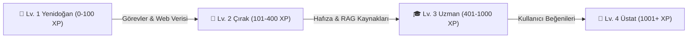

# Otonom AI Agent & Büyüme Rehberi (AI Agent Playbook)

Bu rehber; AWS Bedrock tabanlı otonom botların nasıl oluşturulacağını, özel bilgi kaynaklarının (RAG) nasıl bağlanacağını ve **"Yaşayan & Büyüyen Ajan (Living Agent IQ)"** mekanizmasının nasıl çalıştığını açıklar.

---

## 🧙‍♂️ 1. Kolay Bot Oluşturma Sihirbazı (Step-by-Step Wizard)

Kullanıcıyı teknik karmaşadan uzak tutan 4 adımlı yapı:

1. **Adım 1: Kimlik & Rol & Hedef (Persona & Goal):**
   - **İkon & Bot Adı:** Örn: `📰 Canlı Teknoloji & AI Haber Casusu`
   - **Hedef Tanımı (`goal_definition`):** "İnternetten son 24 saatin kritik teknoloji gelişmelerini tarayıp özetlemek."
   - **İletişim Tonu:** Resmi, Samimi, Teknik veya Doğrudan.

2. **Adım 2: Özel Bilgi Kaynakları (Zero-Cost Local RAG):**
   - **Website URL / Doküman Linki:** Botun okuyup indeksleyeceği web adresi (Örn: `https://aws.amazon.com/bedrock/`).
   - **Özel Şirket / Ürün Notları:** Botun her zaman bilmesi gereken kurallar ve fiyat listeleri.

3. **Adım 3: Yetenekler & Kanallar (Tools & Dispatch):**
   - 🌐 **Canlı Web & Haber Arama:** DuckDuckGo tabanlı canlı araştırma.
   - 📱 **Telegram Çift Yönlü İletişim:** Görev sonuçlarını ve alarmları Telegram'a anlık iletme.
   - 🐍 **Güvenli Python Kod Yorumlayıcı:** Matematiksel ve algoritmik hesaplamalar.
   - ⏰ **Zamanlayıcı (Cron):** Her 30 dakikada bir, her saat başı veya her sabah 09:00'da otomatik çalışma.

4. **Adım 4: Model & Zeka Düzeyi:**
   - ⚡ **Amazon Nova Micro ($0.000035/1k):** Ultra ekonomik cron görevleri.
   - 🚀 **Claude 3.5 Haiku ($0.0008/1k):** Hızlı ve akıllı asistan.
   - 🧠 **Claude 3.7 Sonnet ($0.003/1k):** Hibrit muhakeme ve derin analiz.

---

## 🌱 2. "Yaşayan & Büyüyen Ajan" (Living Agent IQ & Evolution)

Botlar sabit ve statik yazılımlar değildir; her sohbet, görev ve veri kaynağıyla gelişirler:

### 2.1. Seviye Tablosu
- **Lv. 1 🌱 Yenidoğan:** Temel prompt ile çalışır, hafızası yeni oluşmaktadır.
- **Lv. 2 🌿 Çırak:** Kullanıcının adını, dilini ve temel tercihlerini ezberler.
- **Lv. 3 🎓 Uzman:** Canlı web ve API kaynaklarını kusursuz sentezler.
- **Lv. 4 👑 Üstat:** En yüksek sezgisel hafıza, hata düzeltme ve otonom problem çözme zekasına ulaşır.

### 2.2. XP Kazanma Mekanizmaları
- **Görev Tamamlama:** `+20 XP`
- **Canlı Web / API Verisi İşleme:** `+30 XP`
- **Yeni Tercih / Bilgi Öğrenme:** `+15 XP`
- **Bilgi Kaynağı (URL/Doküman) Ekleme:** `+40 XP`
- **Kullanıcı Olumlu Geri Bildirimi (Upvote):** `+50 XP`

### 2.3. Dinamik IQ Skoru Hesaplama
$$\text{IQ Skoru} = 85 + \min(30, \text{Görevler} \times 2) + \min(35, \text{Hafıza Maddeleri} \times 3) + \min(25, \text{Kaynaklar} \times 5) + (\text{Seviye} \times 10)$$

---

## 🎯 3. ReAct Muhakeme & Öz-Değerlendirme (Self-Reflection)

Model görevleri yürütürken 4 adımlı akıl yürütme döngüsünü uygular:
1. **THOUGHT (Düşünce):** "Kullanıcı güncel borsa ve teknoloji verisi istedi, önce web araması yapmalıyım."
2. **ACTION (Eylem):** `web_search({"query": "AI news today"})`
3. **OBSERVATION (Gözlem):** Arama motorundan gelen canlı sonuçlar.
4. **REFLECTION (Öz-Değerlendirme):** "Tüm veriler toplandı mı? Kullanıcının hedefine tam olarak uyuyor mu?" ➔ Nihai yanıt oluşturulur.
