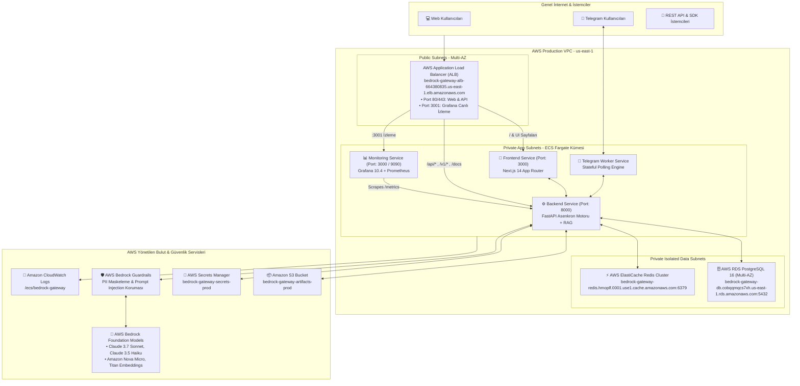

# 🏛️ Sistem & Bulut Mimarisi (End-to-End System Architecture)

Bu doküman; **AWS Bedrock AI Gateway**, **Otonom Agent Motoru** ve **AWS Bulut Altyapısı**'nın uçtan uca teknik mimarisini, veri akışını, ağ topolojisini ve güvenlik sınırlarını detaylandırmaktadır.

---

## ☁️ 1. AWS Bulut Altyapı Topolojisi (VPC & Container Architecture)

---

## 🤖 2. 10 Temel Mimari Bileşenli Otonom Agent Motoru

Platform, otonom yapay zeka ajanlarını 10 modüler bileşen üzerinden yönetir:

### 2.1. Kimlik ve Persona Tanımı (`goal_definition`)
- Her agent için **Rol**, **Hedef Tanımı (`goal_definition`)**, **İletişim Tonu** ve **Sınırları** açıkça yapılandırılır. Model, her göreve bu kimlik çerçevesinde başlar.

### 2.2. 3-Katmanlı Hafıza Motoru (`memory_engine.py` & `semantic_memory.py`)
- **Katman 1 (Kısa Süreli Hafıza):** Son 6 mesaj tam metin tutulur; eski mesajlar tek bir arka plan paragrafına sıkıştırılır (**%75+ token tasarrufu**).
- **Katman 2 (Uzun Süreli Hafıza / Mem0 Standardı):** Kullanıcının tercihleri, uzmanlık alanı, dili ve kuralları yapılandırılmış `SemanticMemoryFact` grafında saklanır. Soruyla ilgili maddeler semantik benzerlikle çekilir.
- **Katman 3 (Çalışma Hafızası / Scratchpad):** Çok adımlı ReAct görevlerinde ara bulgular saklanır.

### 2.3. Native AWS Bedrock Converse API Tool Calling (`bedrock_tools.py`)
- Regex metin taklidi yerine AWS Bedrock'un resmi **`toolConfig`** standardı kullanılır:
  - `web_search`: DuckDuckGo canlı internet ve haber taraması.
  - `python_interpreter`: İzolasyonlu stdout/globals sandbox ortamında güvenli Python kod çalıştırma.
  - `finance_market_data`: Anlık borsa, kripto ve döviz kurları.
  - `schedule_reminder`: Zamanlayıcı ve alarmlar.

### 2.4. ReAct Muhakeme & Öz-Değerlendirme (Self-Reflection)
- Model `Thought ➔ Action ➔ Observation ➔ Reflection (Öz-Değerlendirme)` adımlarını izler. Araçtan gelen veriyi hedefe göre denetler; eksikse ek arama yapar, tamamsa nihai cevabı üretir.

### 2.5. Otonomi Düzeyleri (Human-in-the-Loop)
- **`AUTONOMOUS`:** Görevi baştan sona kendi başına tamamlar.
- **`CONFIRMATION_REQUIRED`:** Kritik eylemlerde kullanıcı onayı ister.
- **`ADVISORY`:** Yalnızca tavsiye ve bilgi sunar.

### 2.6. Maliyetsiz Yerel Vektör RAG (`local_rag.py`)
- Harici pahalı vektör veritabanı gerektirmeden kullanıcı tarafından verilen Website URL'leri veya dokümanlar 450 karakterlik parçalara (overlapping chunks) bölünür; BM25 ve Cosine benzerlik algoritmasıyla sadece en alakalı parçalar prompt'a enjekte edilir.

### 2.7. AWS Bedrock Guardrails & Güvenlik (`guardrails.py`)
- Kredi kartı, telefon ve e-posta numaraları için **PII Maskeleme (Anonymization)**.
- Sistem talimatlarını aşmaya yönelik **Prompt Injection & Jailbreak Koruması**.

### 2.8. Stateful Model Context Protocol (MCP) Server (`mcp_server.py`)
- Standart MCP protokolü ile oturumlar arası bağlam saklama ve dinamik araç çalıştırma yeteneği.

### 2.9. Yaşayan & Büyüyen Ajan (Living Agent IQ - `agent_growth.py`)
- Botlar **🌱 Yenidoğan (Lv 1) ➔ 🌿 Çırak (Lv 2) ➔ 🎓 Uzman (Lv 3) ➔ 👑 Üstat (Lv 4)** seviyelerine yükselir.
- Görev tamamlama (+20 XP), canlı veri işleme (+30 XP) ve kullanıcı beğenileriyle (+50 XP) dinamik IQ puanı artar.

### 2.10. Çok Kanallı İletişim (Web Studio & Telegram Bot)
- Frontier Web Studio ve Telegram Asistan Botu (`@BedrocksAiBot`) aynı hafıza ve model havuzunu paylaşır.
