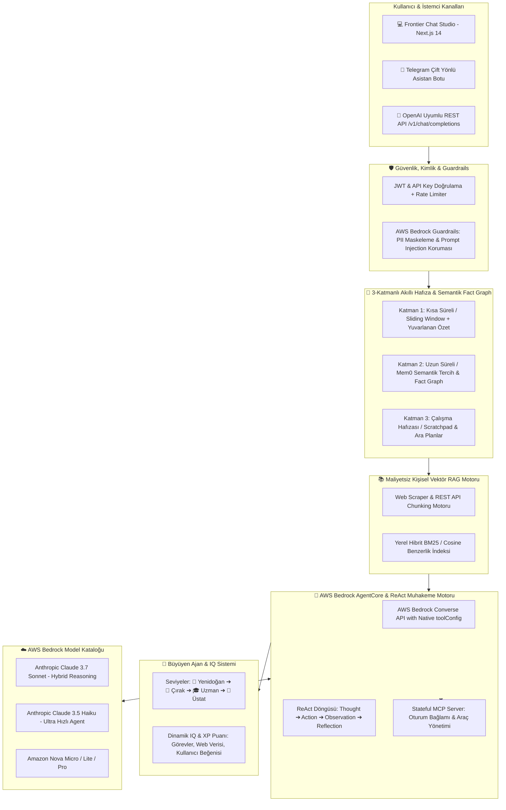

# Bedrock AI Gateway & Otonom Agent Sistem Mimarisi

Bu doküman; **AWS Bedrock AI Gateway**, **10 Temel Mimari Bileşenli Otonom Agent Motoru**, **Mem0 Standardı Semantik Hafıza Grafı**, **Maliyetsiz Yerel Vektör RAG**, **Büyüyen Ajan (Living Agent IQ & Evolution)** ve **Stateful MCP Server** katmanlarının teknik mimarisini detaylandırmaktadır.

---

## 🏛️ 1. Genel Sistem Mimarisi & Veri Akışı

---

## 🌟 2. 10 Temel Mimari Bileşen

### 2.1. Kimlik ve Amaç Tanımı (Persona & System Prompt)
- Her agent için **Rol**, **Hedef & Başarı Kriteri** (`goal_definition`), **İletişim Tonu** (Resmi, Samimi, Teknik) ve **Sınırlar** net olarak tanımlanır.
- "Bu agent'ın var olma sebebi tek cümleyle nedir?" sorusunun yanıtı doğrudan hedef tanımı olarak kaydedilir.

### 2.2. 3-Katmanlı Hafıza & Token / Maliyet Tasarrufu (`memory_engine.py` & `semantic_memory.py`)
- **Katman 1 (Kısa Süreli):** Son 6 mesaj canlı tutulur, eski konuşmalar tek paragrafa sıkıştırılır (**%75+ token tasarrufu**).
- **Katman 2 (Uzun Süreli / Mem0 Standardı):** Kullanıcı adı, uzmanlığı, dil ve kodlama tercihleri yapılandırılmış `SemanticMemoryFact` grafında saklanır. Sadece soruyla semantik olarak ilgili maddeler çekilir.
- **Katman 3 (Çalışma Hafızası / Scratchpad):** Çok adımlı görevlerde ara araştırma verileri hafızada tutulur.

### 2.3. Minimal Araç Seti & Native Bedrock Tool Calling (`bedrock_tools.py`)
- Regex metin taklidi yerine AWS Bedrock'un resmi **`toolConfig`** standardı kullanılır:
  - `web_search`: DuckDuckGo canlı internet ve haber taraması.
  - `python_interpreter`: İzolasyonlu stdout/globals sandbox ortamında güvenli Python kod çalıştırma.
  - `finance_market_data`: Anlık borsa/kripto fiyat ve kur sorgulama.
  - `schedule_reminder`: Zamanlayıcı ve alarmlar.

### 2.4. Planlama ve Muhakeme (ReAct Engine - `reasoning_engine.py`)
- Model `Thought ➔ Action ➔ Observation ➔ Reflection (Öz-Değerlendirme)` adımlarıyla akıl yürütür.

### 2.5. Otonomi Seviyeleri (Human-in-the-Loop)
- **`AUTONOMOUS` (Tam Otonom):** Araçları doğrudan yürütür.
- **`CONFIRMATION_REQUIRED` (Onay Bekleyen):** Kritik eylemlerde onay ister.
- **`ADVISORY` (Öneri Veren):** Kararı kullanıcıya bırakır.

### 2.6. Bilgi Kaynağı (Maliyetsiz Vektör RAG - `local_rag.py`)
- Harici pahalı veritabanı gerektirmeden web URL'leri veya API verileri 450 karakterlik parçalara bölünür ve BM25/Cosine benzerlik algoritmasıyla yalnızca en alakalı parçalar prompt'a dahil edilir.

### 2.7. Güvenlik & Guardrails (`guardrails.py`)
- Kredi kartı, e-posta ve telefon numaraları için **PII Maskeleme**.
- **Prompt Injection & Jailbreak Filtresi** ile model güvenliği sağlanır.

### 2.8. Gözlemlenebilirlik & İzleme
- Tüm araç çağrıları, yürütme süreleri (ms), tüketilen tokenlar ve maliyetler `agent_execution_logs` tablosunda saklanır.

### 2.9. Yaşayan & Büyüyen Ajan (Living Agent IQ - `agent_growth.py`)
- Botlar **Lv. 1 🌱 Yenidoğan ➔ Lv. 2 🌿 Çırak ➔ Lv. 3 🎓 Uzman ➔ Lv. 4 👑 Üstat** şeklinde XP kazanarak seviye atlar.
- Görev tamamlama, canlı veri işleme ve kullanıcı beğenileriyle dinamik IQ puanı yükselir.

### 2.10. Çok Kanallı Entegrasyon (Web & Telegram)
- Frontier Web Chat ve Telegram Bot ortak hafıza ve yetenek havuzunu kullanır.
