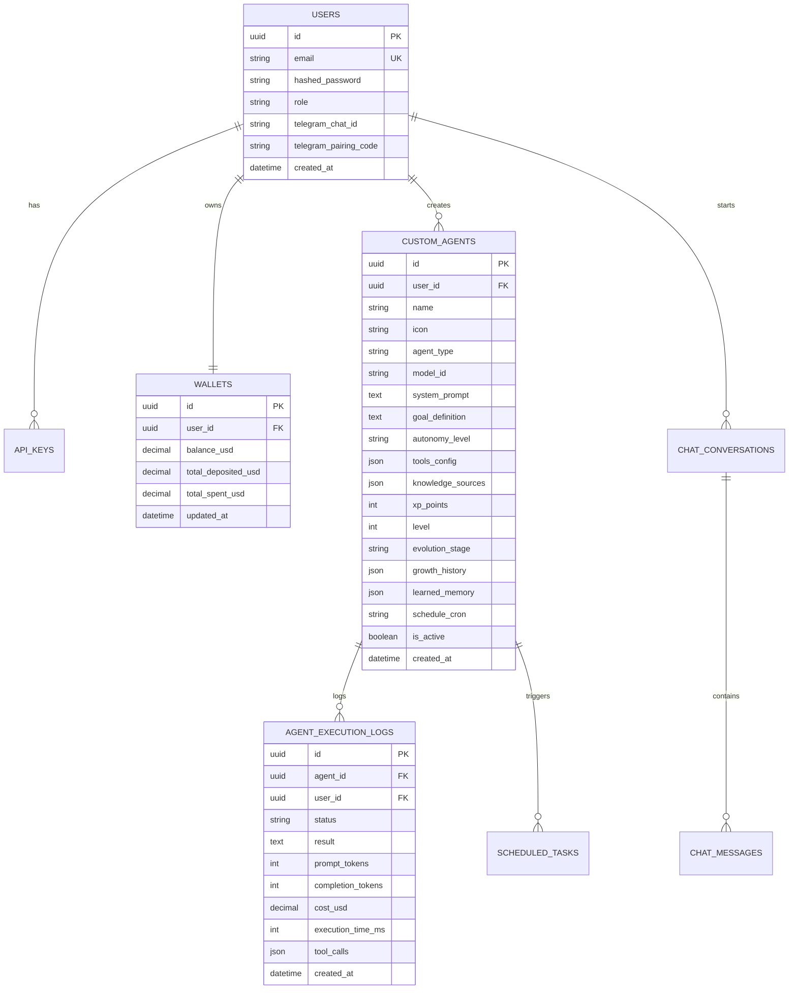

# 🗄️ Veritabanı Şeması & Veri Mimarisi (Database & Cache Schema)

Bu doküman; **AWS RDS PostgreSQL 16** ve **AWS ElastiCache Redis** veri katmanlarının entity modellerini, ilişkilerini, indekslerini ve önbellek anahtar hiyerarşisini listeler.

---

## 🗄️ 1. AWS RDS PostgreSQL Tablo Şeması

---

## 📊 2. Tablo Tanımları ve Alan Detayları

### 2.1. `custom_agents` (Otonom Ajanlar & Büyüme)
| Kolon | Tip | Açıklama |
| :--- | :--- | :--- |
| `id` | `UUID` (PK) | Benzersiz agent kimliği |
| `user_id` | `UUID` (FK) | Botun sahibi olan kullanıcı |
| `name` | `VARCHAR(255)` | Botun adı |
| `icon` | `VARCHAR(16)` | Emoji ikonu (`📰`, `📈`, `🤖`...) |
| `model_id` | `VARCHAR(128)` | Kullanılan AWS Bedrock model kimliği |
| `goal_definition`| `TEXT` | Botun var olma amacı ve başarı kriteri |
| `autonomy_level` | `VARCHAR(32)` | `AUTONOMOUS`, `CONFIRMATION_REQUIRED`, `ADVISORY` |
| `tools_config` | `JSON` | Aktif araçlar (`web_search: true`, `telegram: true`...) |
| `knowledge_sources` | `JSON` | Eklenen Web URL ve özel RAG dokümanları listesi |
| `xp_points` | `INTEGER` | Kazanılan toplam tecrübe puanı |
| `level` | `INTEGER` | Ajan seviyesi (1, 2, 3, 4) |
| `evolution_stage` | `VARCHAR(64)` | `🌱 Yenidoğan`, `🌿 Çırak`, `🎓 Uzman`, `👑 Üstat` |
| `growth_history` | `JSON` | Seviye atlama ve IQ geçmiş kayıtları |
| `learned_memory` | `JSON` | Mem0 standardında çıkarılan kullanıcı tercih ve kuralları |

---

## ⚡ 3. AWS ElastiCache Redis Anahtar Yapısı

| Anahtar Deseni | TTL | Kullanım Amacı |
| :--- | :---: | :--- |
| `ratelimit:{user_id}:{minute}` | 60s | Token-Bucket API istek hız sınırlayıcı (RPM) |
| `session:{jwt_token_jti}` | 24h | JWT oturum geçerlilik ve yetki önbelleği |
| `lock:agent_run:{agent_id}` | 120s | Aynı anda birden fazla tetiklenmeyi engelleyen kilit |
| `cache:web_search:{hash(query)}` | 15m | DuckDuckGo web arama sonuç önbelleği (Maliyet tasarrufu) |
| `cache:rag_chunk:{hash(url)}` | 1h | Web sitelerinden çekilen RAG metin parçaları |
