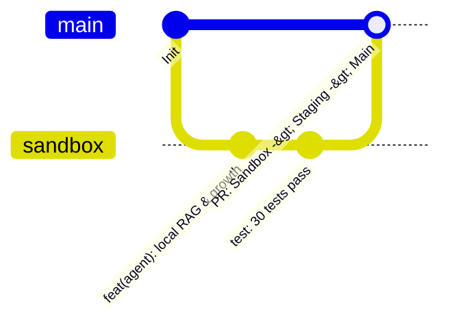

# Dağıtım & GitOps Rehberi (Deployment & GitOps)

Bu rehber; **Terraform Modüler IaC**, **GitHub Actions OIDC ile Secretless AWS Dağıtımı** ve **Sandbox ➔ Staging ➔ Main GitOps Pipeline** akışını açıklar.

---

## 🚀 1. GitOps & Branching Stratejisi



1. **`sandbox`:** Geliştirme ve deneysel özelliklerin ilk uygulandığı dal.
2. **`staging`:** Ön üretim ve entegrasyon testlerinin yürütüldüğü ortam.
3. **`main`:** Canlı üretim (Production) ortamı. Doğrudan `main` dalına push yapılmaz; PR ve kalite kapılarından geçilerek alınır.

---

## 🏗️ 2. Terraform Modülleri ile AWS Kurulumu

Altyapı `terraform/` dizini altında modüler olarak tanımlanmıştır:

```bash
cd terraform/environments/sandbox
terraform init
terraform plan
terraform apply
```

### Modül Dağılımı:
- **`modules/iam/`:** AWS Bedrock, S3 ve DynamoDB için en az yetki prensipli (least privilege) roller ve GitHub Actions OIDC entegrasyonu.
- **`modules/bedrock_guardrails/`:** PII maskeleme ve prompt injection koruma katmanı.
- **`modules/knowledge_base/`:** S3 bilgi tabanı ve DynamoDB stateful hafıza tablosu.
- **`modules/bedrock_agentcore/`:** Claude 3.7 Sonnet ve Claude 3.5 Haiku modellerine bağlı agent tanımları.

---

## 🛡️ 3. GitHub Actions OIDC ile Secretless CI/CD

Sabit AWS Access Key ve Secret Key saklamak yerine, **GitHub OIDC Identity Provider** üzerinden `sts:AssumeRoleWithWebIdentity` ile geçici token alınır:

```yaml
name: Deploy Sandbox Infrastructure
on:
  push:
    branches: [ sandbox ]

jobs:
  deploy:
    runs-on: ubuntu-latest
    permissions:
      id-token: write
      contents: read
    steps:
      - uses: actions/checkout@v4
      - name: Configure AWS Credentials via OIDC
        uses: aws-actions/configure-aws-credentials@v4
        with:
          role-to-assume: arn:aws:iam::ACCOUNT_ID:role/sandbox-bedrock-github-actions-role
          aws-region: us-east-1
      - name: Terraform Apply
        run: |
          cd terraform/environments/sandbox
          terraform init
          terraform apply -auto-approve
```
