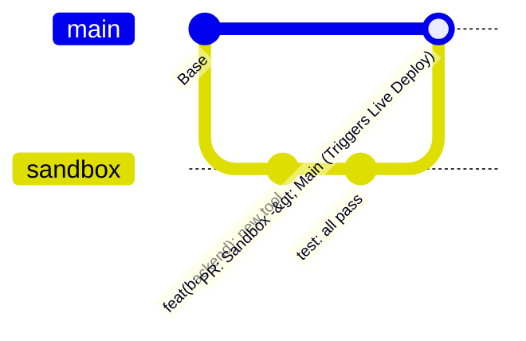

# 🚀 Geliştirici & DevOps Başlangıç Rehberi (Developer & DevOps Onboarding)

Bu doküman; **Bedrock AI Gateway & Otonom Agent Platformu** projesine yeni katılan **Yazılım Geliştiriciler (Frontend/Backend)** ve **DevOps/Cloud Mühendisleri** için uçtan uca mimariyi, çalışma standartlarını ve geliştirme talimatlarını açıklar.

---

## 🧭 1. Proje Özeti ve Temel Misyon

Bu platform; **AWS Bedrock** yapay zeka modellerini (Anthropic Claude 3.7 Sonnet, Claude 3.5 Haiku, Amazon Nova Micro) tek bir standart OpenAI uyumlu `/v1` API ve zengin **Frontier Web Arayüzü** altında toplayan kurumsal bir yapay zeka geçididir.

### ✨ Temel Yetenekler:
1. **10 Bileşenli Otonom Agent Motoru:** ReAct döngüsü, öz-değerlendirme (self-reflection) ve canlı web/API taraması.
2. **3-Katmanlı Akıllı Hafıza & Mem0 Fact Graph:** Konuşmaları sıkıştırarak **%80+ token ve maliyet tasarrufu** sağlar.
3. **Maliyetsiz Yerel Hibrit Vektör RAG:** Harici veritabanı maliyeti olmadan web URL'lerini ve dokümanları indeksler.
4. **Yaşayan & Büyüyen Ajan (Living Agent IQ):** Botlar görev yaptıkça seviye atlar (🌱 Yenidoğan ➔ 👑 Üstat) ve IQ kazanır.
5. **AWS Bedrock Guardrails:** PII (Kredi kartı, telefon, e-posta) maskeleme ve Prompt Injection koruması.
6. **Stateful Model Context Protocol (MCP) Server:** Oturumlar arası kalıcı bağlam ve araç orkestrasyonu.
7. **Çok Kanallı Entegrasyon:** Frontier Web Studio ve Telegram Asistan Botu (`@BedrocksAiBot`).

---

## ⚡ 2. 5 Dakikada Hızlı Başlangıç (Local Development)

### 2.1. Gereksinimler
- Python 3.11 veya 3.12
- Node.js 18+ veya 20+
- Docker & Docker Compose (Opsiyonel ama önerilir)

### 2.2. Adım Adım Kurulum:

```bash
# 1. Depoyu klonlayın ve sanal ortamı kurun
git clone https://github.com/sahinbolukbasi/bedrock-api.git
cd bedrock-api
python3 -m venv venv
source venv/bin/activate
pip install -r backend/requirements.txt

# 2. Frontend bağımlılıklarını yükleyin
cd frontend && npm install && cd ..

# 3. Çevre değişkenlerini hazırlayın
cp .env.example .env
# (.env dosyası .gitignore içindedir, gizli anahtarlarınızı buraya yazabilirsiniz)
```

### 2.3. Servisleri Başlatma:

```bash
# Seçenek A: Tek Komutla Başlatma Betiği
chmod +x scripts/start_local.sh
./scripts/start_local.sh

# Seçenek B: Docker Compose ile Tüm Yığını Başlatma
docker compose up -d

# Seçenek C: Manuel Ayrı Ayrı Başlatma
# Terminal 1 (Backend):
PYTHONPATH=backend ./venv/bin/uvicorn app.main:app --reload --port 8000

# Terminal 2 (Frontend):
cd frontend && npm run dev

# Terminal 3 (Telegram Bot):
./venv/bin/python -m telegram_bot.bot
```

### 🌐 Yerel Erişim Portları:
- 💻 **Web Portalı:** `http://localhost:3000`
- ⚙️ **Backend API & Swagger:** `http://localhost:8000/docs`
- 📊 **Grafana İzleme Paneli:** `http://localhost:3001` (Giriş: `admin` / `AdminPassword123!`)
- 📈 **Prometheus Metrikleri:** `http://localhost:8000/metrics`

---

## 📂 3. Kod Mimarisi & Klasör Hiyerarşisi

```
bedrock/
├── backend/                  # ⚙️ FastAPI Python Backend
│   ├── app/
│   │   ├── api/              # REST API rotaları (Agents, Auth, Keys, Wallet, Chat)
│   │   ├── core/             # Config, Veritabanı, Metrics (Prometheus), Secrets Manager
│   │   ├── domain/           # Pydantic V2 Schemas & DTOs
│   │   ├── models/           # SQLAlchemy ORM Varlıkları (User, CustomAgent, Wallet...)
│   │   ├── providers/        # AWS Bedrock Converse API Provider & Tool Calling
│   │   └── services/         # Guardrails, MCP Server, Local RAG, Agent Growth, Semantic Memory
│   └── tests/                # 37+ Kapsamlı Pytest Birim ve Entegrasyon Testi
│
├── frontend/                 # 🎨 Next.js 14 App Router & Tailwind Web Portalı
│   ├── src/app/              # Sayfalar (Chat Studio, 4-Step Agent Wizard, API Keys, Admin)
│   └── src/components/       # UI Bileşenleri (Navigation, ChatDock, EvolutionBadge...)
│
├── telegram_bot/             # 📱 Çift Yönlü Telegram Asistan Botu (Polling Worker)
├── monitoring/               # 📊 Grafana & Prometheus Docker İmajı & Provisioning JSON
├── terraform/                # 🏗️ Modüler AWS Terraform IaC Altyapısı
│   ├── modules/              # iam, bedrock_guardrails, knowledge_base, bedrock_agentcore
│   └── environments/sandbox/ # Dağıtılabilir Sandbox Ortamı
├── .github/workflows/        # 🚀 Path-Based Ayrık Micro-CI/CD Pipeline Dosyaları
└── docs/                     # 📚 Tüm Mimari, Güvenlik ve API Dokümantasyonu
```

---

## 🌿 4. GitOps & Branching Standartları (Branching Strategy)

Doğrudan `main` dalına push yapmak yasaktır. Platform **Sandbox ➔ Staging ➔ Main** akışını kullanır:



1. **`sandbox`:** Yeni özelliklerin, deneysel geliştirmelerin yapıldığı aktif geliştirme dalı.
2. **`staging`:** Entegrasyon testlerinin ve son onayların yürütüldüğü ön canlı dalı.
3. **`main`:** Canlı üretim (Production) ortamı.

### 🚀 Canlıya Alma Kuralı (Production Deployment Policy):
- **Canlıya alma işlemi SADECE `main` dalına Pull Request (PR) açılıp merge edildiğinde otomatik olarak çalışır.**
- `sandbox` veya `staging` dallarındaki push işlemleri canlı ortamı kesintiye uğratmaz.

---

## 🔐 5. Güvenlik & DevSecOps Kuralları (Önemli!)

1. **Sıfır Hardcoded Secret Kuralı:**
   - Kod dosyalarına, frontend JSX'e veya commit mesajlarına **asla token, şifre veya AWS Secret Key yazmayın.**
   - Tüm gizli anahtarlar `backend/app/core/secrets_manager.py` üzerinden **AWS Secrets Manager** (`bedrock-gateway-secrets-prod`) veya yerel `.env` dosyasından okunmalıdır.
2. **Gitleaks Taraması:**
   - Açılan her PR'da `gitleaks` otomatik olarak gizli anahtar taraması yapar; açıkta anahtar bulunursa PR engellenir.
3. **AWS Bedrock Guardrails:**
   - Model çağrıları öncesi `EnterpriseGuardrailService` ile PII (Kredi kartı, e-posta, telefon) maskelemesi otomatik devreye girer.

---

## 🧪 6. Test & Kalite Kapıları (Quality Gates)

PR açmadan önce aşağıdaki 3 testi yerel ortamınızda mutlaka çalıştırın:

```bash
# 1. Backend Test Paketi (Tüm 37 test başarılı olmalıdır)
PYTHONPATH=backend ./venv/bin/pytest backend/tests/

# 2. Frontend Next.js Derleme & TypeScript Doğrulaması
cd frontend && npm run build && cd ..

# 3. Terraform Sözdizimi Doğrulaması (DevOps için)
cd terraform/environments/sandbox
terraform init -backend=false
terraform validate
cd ../../..
```

---

## ☁️ 7. Canlı AWS Üretim Mimarisi Özeti

- **AWS Yük Dengeleyici (ALB):** `bedrock-gateway-alb-664380835.us-east-1.elb.amazonaws.com`
  - Port 80 / 443: Web Portalı & Backend API
  - Port 3001: Grafana Canlı İzleme Paneli
- **AWS ECS Fargate:** Backend API, Frontend, Telegram Bot ve Monitoring konteynerleri.
- **AWS RDS PostgreSQL (Multi-AZ):** `bedrock-gateway-db.cobqqmqcs7xh.us-east-1.rds.amazonaws.com`
- **AWS ElastiCache Redis:** `bedrock-gateway-redis.hmoplf.0001.use1.cache.amazonaws.com`
- **AWS Secrets Manager:** `bedrock-gateway-secrets-prod`
- **AWS CloudWatch Log Grubu:** `/ecs/bedrock-gateway`

---

## 🤝 8. İletişim ve Katkı Adımları
1. Yeni bir özellik geliştirmeden önce `sandbox` dalından `feat/ozellik-adi` dalı açın.
2. Kodunuzu yazın, testlerin (`pytest`, `npm run build`) geçtiğinden emin olun.
3. `sandbox` dalına PR açın.
4. Onaylandıktan sonra `staging` ve nihai olarak `main` dalına PR açarak canlıya alın.
