# 📚 AWS Bedrock AI Gateway — Ana Teknik Dokümantasyon Portalı

Bu portal; **AWS Bedrock AI Gateway**, **Otonom Agent Platformu**, **Bulut Altyapısı (AWS ECS Fargate / RDS / Redis)** ve **DevOps CI/CD Mimarisi** için tek ve kesin teknik referans kaynağıdır.

---

## ⚡ 1. Canlı Sistem & Erişim Noktaları Tablosu

| Servis / Katman | Canlı Erişim Adresi | Port | Konteyner / AWS Servisi |
| :--- | :--- | :---: | :--- |
| 🎨 **Frontend Web Portalı** | `http://bedrock-gateway-alb-664380835.us-east-1.elb.amazonaws.com` | `3000` (ALB: 80) | AWS ECS Fargate: `bedrock-gateway-frontend-svc` |
| ⚙️ **Backend API Servisi** | `http://bedrock-gateway-alb-664380835.us-east-1.elb.amazonaws.com:8000` | `8000` | AWS ECS Fargate: `bedrock-gateway-backend-svc` |
| 📖 **Swagger / OpenAPI** | `http://bedrock-gateway-alb-664380835.us-east-1.elb.amazonaws.com/docs` | `8000` | FastAPI Interactive Swagger UI |
| 📊 **Grafana Canlı İzleme** | `http://bedrock-gateway-alb-664380835.us-east-1.elb.amazonaws.com:3001` | `3001` | AWS ECS Fargate: `bedrock-gateway-monitoring-svc` |
| 📈 **Prometheus Metrikleri**| `http://bedrock-gateway-alb-664380835.us-east-1.elb.amazonaws.com/metrics` | `8000` | Prometheus Scrape Endpoint |
| 📱 **Telegram Asistan Botu**| `https://t.me/BedrocksAiBot` (`@BedrocksAiBot`) | Polling | AWS ECS Fargate: `bedrock-gateway-telegram-svc` |
| 🗄️ **RDS PostgreSQL DB** | `bedrock-gateway-db.cobqqmqcs7xh.us-east-1.rds.amazonaws.com` | `5432` | AWS RDS PostgreSQL 16 (Multi-AZ VPC) |
| ⚡ **ElastiCache Redis** | `bedrock-gateway-redis.hmoplf.0001.use1.cache.amazonaws.com` | `6379` | AWS ElastiCache Redis Cluster |
| 🔐 **AWS Secrets Manager** | `bedrock-gateway-secrets-prod` | API | AWS Secrets Manager (us-east-1) |
| 📝 **CloudWatch Log Grubu** | `/ecs/bedrock-gateway` | AWS CLI | AWS CloudWatch Log Streams |

---

## 🧭 2. Dokümantasyon Modülleri İndeksi

```mermaid
graph TD
    Root[docs/ Master Portal] --> Arch[ARCHITECTURE.md<br/>Uçtan Uca Sistem & Ağ Mimarisi]
    Root --> Catalog[AWS_RESOURCE_CATALOG.md<br/>36+ AWS Kaynağının ARN & ID Haritası]
    Root --> Deploy[DEPLOYMENT.md<br/>5 Path-Based Micro-CI/CD & GitOps]
    Root --> API[API_REFERENCE.md<br/>Eksiksiz REST API & OpenAI /v1]
    Root --> DB[DATABASE_SCHEMA.md<br/>PostgreSQL Tabloları & Redis Anahtarları]
    Root --> Monitor[MONITORING_AND_LOGS.md<br/>Grafana Dashboards & PromQL Metrikleri]
    Root --> Security[SECURITY.md<br/>Guardrails, PII Filtreleme & DevSecOps]
    Root --> Bot[TELEGRAM_AND_AUTONOMOUS_BOTS.md<br/>Telegram Stateful Engine & Cron]
    Root --> Agent[AI_AGENT_PLAYBOOK.md<br/>ReAct Muhakeme & Yaşayan Agent IQ]
    Root --> Onboarding[DEVELOPER_ONBOARDING.md<br/>Yazılımcı & DevOps Hızlı Başlangıç]
    Root --> Debug[TROUBLESHOOTING.md<br/>Hata Çözüm & Olay Müdahale Rehberi]
```

| Doküman | Teknik Kapsam & İçerik |
| :--- | :--- |
| 🏛️ **[ARCHITECTURE.md](file:///Users/sahinbolukbasi/Development/bedrock/docs/ARCHITECTURE.md)** | AWS ECS Fargate, ALB, Multi-AZ VPC, 10 Bileşenli Agent Motoru, 3-Katmanlı Hafıza, Local RAG, Stateful MCP. |
| 🌐 **[AWS_RESOURCE_CATALOG.md](file:///Users/sahinbolukbasi/Development/bedrock/docs/AWS_RESOURCE_CATALOG.md)** | Resource Group, Tüm ARN'ler, Security Group ID'leri, Bedrock Model ID'leri ve Fiyatlandırma. |
| 🚀 **[DEPLOYMENT.md](file:///Users/sahinbolukbasi/Development/bedrock/docs/DEPLOYMENT.md)** | 5 Path-Based CI/CD Workflow (`backend`, `frontend`, `telegram`, `monitoring`, `infra`), Main-only deploy, Terraform IaC. |
| 📡 **[API_REFERENCE.md](file:///Users/sahinbolukbasi/Development/bedrock/docs/API_REFERENCE.md)** | OpenAI uyumlu `/v1/chat/completions`, `/api/agents`, `/api/agents/{id}/knowledge`, API Keys, Wallet. |
| 🗄️ **[DATABASE_SCHEMA.md](file:///Users/sahinbolukbasi/Development/bedrock/docs/DATABASE_SCHEMA.md)** | SQLAlchemy Asyncpg PostgreSQL entity modelleri, DDL şeması, Foreign Key'ler ve Redis Token Bucket anahtarları. |
| 📊 **[MONITORING_AND_LOGS.md](file:///Users/sahinbolukbasi/Development/bedrock/docs/MONITORING_AND_LOGS.md)** | Grafana `:3001` Canlı Paneli, Prometheus Scrape konfigürasyonu, PromQL sorguları, CloudWatch Log okuma. |
| 🔒 **[SECURITY.md](file:///Users/sahinbolukbasi/Development/bedrock/docs/SECURITY.md)** | Bedrock Guardrails (PII Maskeleme & Prompt Injection Koruması), AWS Secrets Manager, Gitleaks, SigV4. |
| 📱 **[TELEGRAM_AND_AUTONOMOUS_BOTS.md](file:///Users/sahinbolukbasi/Development/bedrock/docs/TELEGRAM_AND_AUTONOMOUS_BOTS.md)** | Telegram Bot Worker (`@BedrocksAiBot`), Eşleştirme Kodları (`TG-XXXXXX`), Cron Zamanlayıcı. |
| 🤖 **[AI_AGENT_PLAYBOOK.md](file:///Users/sahinbolukbasi/Development/bedrock/docs/AI_AGENT_PLAYBOOK.md)** | ReAct Muhakeme & Self-Reflection, Living Agent IQ (Lv 1-4), Maliyetsiz Yerel Vektör RAG motoru. |
| 🚀 **[DEVELOPER_ONBOARDING.md](file:///Users/sahinbolukbasi/Development/bedrock/docs/DEVELOPER_ONBOARDING.md)** | 5 dakikada yerel kurulum, Docker Compose, 37 Pytest testi, GitOps PR kuralları. |
| 🛠️ **[TROUBLESHOOTING.md](file:///Users/sahinbolukbasi/Development/bedrock/docs/TROUBLESHOOTING.md)** | 502 Bad Gateway, ECS Task çökme teşhisi, Redis bağlantı hataları, Bedrock kota aşım runbook'u. |
